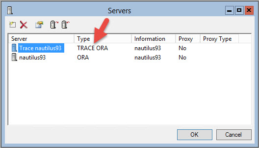
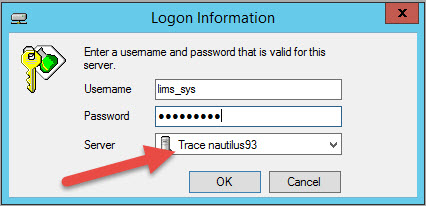
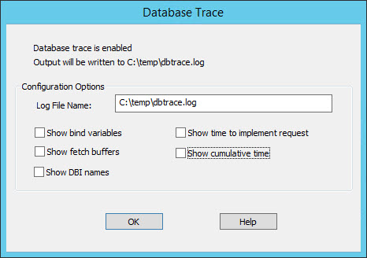
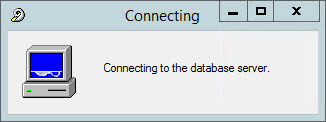
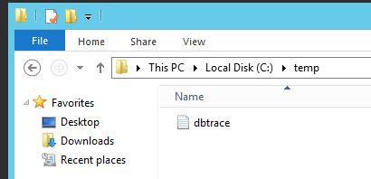
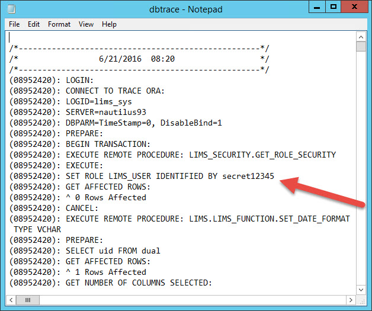

# nautilus-hacks

## Getting lims_user password (#1)

Add a server with `TRACE` preceding the actual Database Type.  



Make sure the "TRACE" part "sticks".  It might not if you create a new server entry, and you'll have to edit the properties. 
You'll know it is good to go when you see "TRACE" in the server list.



Select the trace server and login.



The Database Trace window appears.  You can clear all the checkboxes and provide a log location for saving.



Once you click OK in the Database Trace window, you will be logged in and the Nautilus client will be logging.  
Log out immediately and close Nautilus.

Navigate to the location you saved your trace log.



Open the log and find the keys to the kingdom.  Good grief.




## Getting lims_user password (#2)

Login (any user with lims_readonly) and run query:   

```sql
select lims_security.get_role_security from dual;
```

Will give back something like `H7y5bAD1IidlB1YqxVyusw==`, which is the encrypted password.

Open the .Net IL disassembler, ildasm.exe.  When Visual Studio is installed, ildasm can be found in a path such as `C:\Program Files (x86)\Microsoft SDKs\Windows\v10.0A\bin\NETFX 4.6.1 Tools`.

In ildasm, open NautilusRoleSecurity.exe, which is typically installed in `C:\Nautilus`.  When the exe has been loaded, select File > Dump.  The only required option is "Dump IL Code".  Open the dumped ".il" file with a text editor.  Search for "Vector" and/or "Key" and find the two private field values, like this:

```
.field static assembly literal string Key = "Nautilus"
.field static assembly literal string Vector = "Secret"
```

Make a note of the `Key` and `Vector` values.

Create a new C# console application.  Add `Thermo.Nautilus.BL.Services.dll` as a reference.  It can be found next to NautilusRoleSecurity.exe or next to Nautilus.exe.  Here is example code for the console application:

```csharp
using System;
using Thermo.Nautilus.BL.Services;

namespace DecryptNautilusPasswords
{
    class Program
    {
        static void Main(string[] args)
